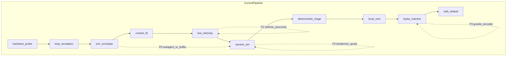

# Routing Quality Roadmap

**Last updated:** 2026-07-11  
**Purpose:** Prioritized implementation backlog for pre-generation routing quality (task success per dollar), ordered by impact.  
**Audience:** Implementers and spine task authors.  
**Companion docs:** [PRD](PRD.md) (pipeline contract), [deep-research](deep-research.md) (architecture survey), [constitution](constitution.md) (non-negotiables), [research/README.md](research/README.md) (provenance index).  
**Provenance:** [research/routing-quality-2026-07.json](research/routing-quality-2026-07.json) (parallel deep-research, run `trun_7b47ebd495b54ca1947d8f81226bce7c`, 2026-07-07); [gemini-research.md](gemini-research.md) (second-source report, 2026-07).

This document is the **authoritative actionable backlog**. Research sources inform it; they are not substitutes for it.

---

## 1. Purpose and hard constraints

pi-smart-router remains a **multi-stage pre-generation router**. Do not pivot to FrugalGPT-style generate-then-judge cascades.

| Constraint | Rule |
|------------|------|
| Pre-generation only | Route before inference; observational loop escalation is allowed; post-gen judging is not |
| Cache-aware session pinning | Pin per session; break only on compaction, override, loop escalation, or cache-warmup economics |
| Latency budgets | Deterministic triage &lt;5ms; embedding stage ~80–120ms; P(success) inference &lt;5ms |
| Self-hosted encoders | Prefer ONNX/WASM/local over routing-via-API |
| Privacy-safe training | Feature vectors + outcome labels; raw prompt text never in the training pipeline |

**Middleware scope:** pi-smart-router intercepts **one LLM request at a time**. Ephemeral sub-agent delegation for planning turns requires pi contract support (explain / delegate output), not only session-pin knobs inside this package.

**Viability verdict:** Multi-stage pre-gen routing is the **design target** (both research sources agree). Conditional on (1) catalog-decoupled capability shortfall matching, (2) cache-preserving planning strategy, (3) calibrated P(success), and (4) honest offline eval on our own traces.

**Pin-on-first-turn:** Emergency **operator fallback only** when shadow quality retention regresses more than ~5% vs “cheapest model that can solve” over a 30-day window — **not** a design pivot. Gemini argues static pin wastes cheap-turn opportunity on mixed-complexity sessions (60–70% trivial traffic — treat as hypothesis until reproduced on pi traces).

---

## 2. Priority ranking (Top 6 by quality / $)

Ordered for **task success per dollar**. Status reflects the codebase as of 2026-07-08.

### P0 — Cache-preserving planning (sub-agent preferred; buffer fallback)

| | |
|--|--|
| **Change** | **Preferred:** ephemeral frontier sub-agent with compressed context; inject result as observation; primary session stays pinned. **Fallback:** `planning_turn_buffer = 2`, then SAAR hard-lock with `prefix_cache_weight`, idle-timeout reopen, turn-index-aware switch threshold. Gate all sub-routes and pin breaks with **cache breakeven** math. |
| **Why first** | Prefix cache can be 30–90% of effective input cost. SP-064 routes planning to frontier while pin metadata stays economical — still an **inference-path cache miss** on that turn (`tests/integration/session-pinning.test.ts`). |
| **Pipeline stages** | `turn_envelope`, `session_pin`, explain/delegate contract |
| **Evidence** | [SAAR (vLLM, 2026-06)](https://vllm.ai/blog/2026-06-02-session-aware-agentic-routing); Weave/Cursor sub-agent patterns; gemini-research §2. Confidence: high. |
| **Effort** | M (buffer) / L (sub-agent + pi contract) |
| **Status** | **Landed** — turn envelope emits `planning_delegate`; pi extension spawns compressed frontier sub-call; primary stays pinned ([#71](https://github.com/beettlle/pi-smart-router/issues/71)). **Remaining:** `planning_turn_buffer` hard-lock interplay, breakeven gate refinements. |
| **Follow-on** | GitHub [#71](https://github.com/beettlle/pi-smart-router/issues/71) (sub-agent delegate), [#72](https://github.com/beettlle/pi-smart-router/issues/72) (SAAR pin), [#73](https://github.com/beettlle/pi-smart-router/issues/73) (cache breakeven). |

### P1 — P(success) calibration (isotonic + richer labels)

| | |
|--|--|
| **Change** | Add **isotonic regression** calibrator (UCCI-style) on top of SP-105 logistic baseline; ship as versioned artifact with &lt;5ms lookup at serve time. Labels: tool-failure chains, invalid `stop_reason`, re-prompt rate, edit distance — not only user thumbs. |
| **Why** | Raw scores are miscalibrated; thresholding without calibration over-escalates to frontier. |
| **Pipeline stages** | `low_intensity`, calibration scripts (SP-116/117) |
| **Evidence** | [SWE-Gym](https://arxiv.org/abs/2412.21139); [ToolRM](https://arxiv.org/abs/2509.11963); UCCI (gemini-research §5 — verify citation before SLO claims). Confidence: high (method), medium (our label volume). |
| **Effort** | M |
| **Status** | **Partial** — SP-104/105/106/116/117 landed; SP-189–SP-191 privacy-safe label packs + pack-fed dry-run ECE close the **label-volume** gap for #102. **Remaining gap:** serve-time isotonic artifact adoption volume, counterfactual eval. |
| **Follow-on** | GitHub [#74](https://github.com/beettlle/pi-smart-router/issues/74); [#102](https://github.com/beettlle/pi-smart-router/issues/102) closable via SP-191; [#96](https://github.com/beettlle/pi-smart-router/issues/96) enablement should use pack holdout ECE (not fixture-only QR) — do not flip `modernbert_k4` defaults until that evidence lands. |

### P1 — Benchmark-grounded capability profiles

| | |
|--|--|
| **Change** | Ground fleet profiles from SWE-bench Verified, **Terminal-Bench** (debugging/tool-use proxy), LiveCodeBench, BFCL/tool-use. Ingest with **Switchcraft-style AST** tool-call validation (not exact string match). Monthly CI refresh with frozen catalog date. |
| **Why** | Static regex defaults (frontier ≈ 0.95) mis-route; Terminal-Bench better reflects terminal interaction than SWE-bench alone. |
| **Pipeline stages** | `hydra_matcher`, `mapPiModelToProfile`, `models.yaml` |
| **Evidence** | [HyDRA arXiv:2605.17106](https://arxiv.org/abs/2605.17106); Switchcraft (gemini-research §4). Confidence: medium–high (methodology). |
| **Effort** | M |
| **Status** | **Partial** — shortfall + YAML/registry exist; scores mostly pattern defaults. SP-115 learned 384×3 projection done. |
| **Follow-on** | GitHub [#75](https://github.com/beettlle/pi-smart-router/issues/75). |

### P2 — OATS offline centroid refinement

| | |
|--|--|
| **Change** | Outcome-aware cluster shift: interpolate centroids toward cheap-tier **success** embeddings, repel from loop-escalation failures. Run in calibration Phase 3; zero serving latency. |
| **Pipeline stages** | `low_intensity`, cluster config, SP-117 train path |
| **Evidence** | OATS (gemini-research §6 — verify citation). Confidence: medium. |
| **Effort** | S–M |
| **Status** | **Partial** — SP-114 bootstrap done; static centroids. |
| **Follow-on** | GitHub [#77](https://github.com/beettlle/pi-smart-router/issues/77); extend SP-117 calibration step. |

### P2 — Virtual cost v2 (quota decay + cache breakeven)

| | |
|--|--|
| **Change** | Deterministic quota decay multiplier λ(remaining_window); exhaustion risk premium; negative term for prefix-cache hits. Explicit breakeven: switch only when `marginal_savings + future_cache_value > cache_reprime_cost`. **Not** SeqRoute HBR+CQL in v1. |
| **Pipeline stages** | `session_pin`, pricing broker, expected-cost (SP-096/106) |
| **Evidence** | SP-096; SAAR; Zylos FinOps; gemini-research §7 (SeqRoute framing only). Confidence: medium. |
| **Effort** | M |
| **Status** | **Partial** — `quota_cost_per_1m` + expected-cost exist. **Missing:** rolling window position, KV savings credit, breakeven in pin-break. |
| **Follow-on** | GitHub [#78](https://github.com/beettlle/pi-smart-router/issues/78) (virtual cost v2); complements [#73](https://github.com/beettlle/pi-smart-router/issues/73) (breakeven). |

### P3 — Encoder upgrade path (Granite 97M before ModernBERT)

| | |
|--|--|
| **Change** | Trial `ibm-granite/granite-embedding-97m-multilingual-r2` (384-dim, long context, ONNX) as drop-in before full ModernBERT retune. Document SP-115 as **approximation** of HyDRA K sigmoid heads on [CLS] — not full HyDRA fidelity. K=4 (+debugging) when calibration Top-1 error warrants. |
| **Pipeline stages** | `hydra_matcher`, shared embedder, artifacts |
| **Evidence** | [ModernBERT arXiv:2412.13663](https://arxiv.org/abs/2412.13663); Granite R2 (gemini-research §3). Confidence: high (long context helps); medium (ops cost). |
| **Effort** | M–L |
| **Status** | **Partial** — MiniLM + SP-115 learned head. **Gap:** long-context encoder option. |
| **Follow-on** | GitHub [#80](https://github.com/beettlle/pi-smart-router/issues/80) (Granite trial), [#81](https://github.com/beettlle/pi-smart-router/issues/81) (ModernBERT/K=4); feature-flag encoder swap. |

---

## 3. Impact-ordered backlog

Beyond Top 6. “P2/P3” here means after P0–P1, not a renumber of Top 6.

| Priority | Change | Expected impact | Pipeline stage(s) | Evidence | Effort | Status | GitHub |
|----------|--------|-----------------|-------------------|----------|--------|--------|--------|
| P0 | Ephemeral planning sub-agent / `planning_delegate` | Preserve cache; frontier reasoning | turn_envelope, explain | Gemini §2, Weave | L | Landed | [#71](https://github.com/beettlle/pi-smart-router/issues/71) |
| P0 | Planning buffer + SAAR pin knobs | Continuity / $ | turn_envelope, session_pin | SAAR | M | Partial | [#72](https://github.com/beettlle/pi-smart-router/issues/72) |
| P0 | Cache breakeven in sub-route / pin-break | Prevent $3 cache miss for $0.30 save | session_pin, expected-cost | Gemini §2, SAAR | M | Gap | [#73](https://github.com/beettlle/pi-smart-router/issues/73) |
| P1 | Isotonic P(success) calibrator | Honest thresholds | low_intensity, calibration | UCCI | M | Gap | [#74](https://github.com/beettlle/pi-smart-router/issues/74) |
| P1 | Benchmark profiles + AST tool validation | Quality floor | hydra, mapper | HyDRA, Switchcraft | M | Partial | [#75](https://github.com/beettlle/pi-smart-router/issues/75) |
| P1 | HyDRA 7-flag metadata prefix (vs SP-112 4-flag) | Better requirement prediction | hydra input | HyDRA | S–M | Partial (SP-112) | [#76](https://github.com/beettlle/pi-smart-router/issues/76) |
| P2 | OATS centroid refinement | Fewer false-low cluster matches | low_intensity, clusters | OATS | S–M | Partial | [#77](https://github.com/beettlle/pi-smart-router/issues/77) |
| P2 | Virtual cost v2 | Subscription-aware $ | pin, pricing | SP-096, SeqRoute* | M | Partial | [#78](https://github.com/beettlle/pi-smart-router/issues/78) |
| P2 | TwinRouterBench + counterfactual replay | Agent-native eval | offline eval | Gemini §9 | L | Gap | [#79](https://github.com/beettlle/pi-smart-router/issues/79) |
| P3 | Granite 97M encoder trial | Long context, 384-dim | hydra | Granite R2 | M | Gap | [#80](https://github.com/beettlle/pi-smart-router/issues/80) |
| P3 | ModernBERT / K=4 heads (true HyDRA) | Full fidelity | hydra | HyDRA 2605.17106 | L | Gap | [#81](https://github.com/beettlle/pi-smart-router/issues/81) |
| P3 | Entropy triage (adversarial) | R2A suffix defense | triage | Gemini §8 | S–M | Partial (sanitization) | [#82](https://github.com/beettlle/pi-smart-router/issues/82) |
| P3 | Explain / telemetry depth | Shadow compare | explain | SP-110/113 | S–M | Partial | Phase 33 |
| P3 | Local zero decoupled from trivial-only | More local share | local_zero | SP-111 | M | Phase 33 | SP-111 |
| P3 | Pin-only operator mode | Emergency fallback | session_pin, config | SAAR | S | Gap | [#83](https://github.com/beettlle/pi-smart-router/issues/83) |
| P3 | Hardware `tokens_per_second` gate | Better local routing | hardware_probe | LiteLLM | M | Gap | [#84](https://github.com/beettlle/pi-smart-router/issues/84) |
| — | Pipeline integration pass | Stage order | all | SP-119 | M | Phase 33 | SP-119 last |
| **Deferred** | SeqRoute MDP + HBR + CQL | Quota RL | — | Gemini §7 | L | Deferred | v2+ research |
| **Deferred** | SAE residual-stream defense | Adversarial | hydra | Gemini §8 | L | Deferred | Phase 2 security |
| **Deferred** | RouteLLM MF secondary head | Paraphrase robustness | hydra | PRD reject | M | Deferred | Only if eval proves need |

\*SeqRoute: adopt deterministic λ framing only, not full RL training.

**Landed foundations:** SP-096 virtual cost, SP-104–106 P(success)+expected cost, SP-112–117 HyDRA prefix / clusters / projection / calibration, session pin + loop escalation + turn envelope.

---

## 4. Pipeline-stage map

| Stage | Recommended policy change |
|-------|---------------------------|
| hardware_probe | Later: rolling `tokens_per_second`; gate local when below usable threshold |
| loop_escalation | Observational only; use failures as **labels** for OATS/P(success) |
| turn_envelope | Planning: **sub-agent delegate** OR `planning_turn_buffer`; never unbounded frontier override on warm economical pin without breakeven |
| context_fit | Keep; explain telemetry for operators |
| low_intensity | Isotonic P(success); OATS-refined clusters as **soft hint** |
| session_pin | SAAR knobs; breakeven on break; hard-lock in tool loops |
| deterministic_triage | Confounder sanitization + entropy check for adversarial suffixes |
| local_zero | SP-111: not trivial-only; respect HW + cold-start |
| hydra_matcher | Grounded profiles; Granite trial; SP-115 = learned approximation |
| safe_default / overflow | Never silent ceiling downgrade |

**Routing rule:** Per-turn routing at turn 0 classification and same-provider `tool_result` sub-routes **with breakeven** — not open-ended planning→frontier mid-session.

---

## 5. Calibration roadmap

| Phase | Goal | Additions (merged) | Repo hooks | Done? |
|-------|------|-------------------|------------|-------|
| **1. Data collection** | Shadow-log features; discard raw prompts | Async encoder features for future Granite trial | telemetry, `data/contrib/` | Partial |
| **2. Labeling** | Cheap-success + failure proxies | Loop escalation, `stop_reason`, edit distance, re-prompt; SWE-Gym / FC-RewardBench / weak TwinRouterBench packs | SP-062, SP-104 export, SP-189–SP-190 | Partial (packs landed; #102) |
| **3. Training** | Calibrated artifacts | OATS centroid shift; isotonic calibrator; projection refresh; pack-fed dry-run ECE | SP-115–117, SP-191 `routing:calibration-dry-run` | Scripts + dry-run; grow pack volume |
| **4. Offline eval** | Agent-native QR/CS/latency | TwinRouterBench static track; counterfactual AST progression; cumulative regret | **Gap:** harness | Proposed |
| **5. Shadow deploy** | Gradual τ relaxation | Fallback to pin-only if QR regresses &gt;5% | explain + config | Proposed |

**Eval anti-pattern:** MT-Bench or HumanEval alone. Prefer SWE-bench traces, Terminal-Bench, tool-loop continuity, counterfactual routing ([RouterBench](https://arxiv.org/abs/2403.12031), [LLMRouterBench](https://arxiv.org/abs/2601.07206), TwinRouterBench per gemini-research).

**Frozen catalog rule:** Pin model catalog + checkpoint date for any published QR/CS; paper numbers are methodology references only.

---

## 6. Research reconciliation

Epistemic rule: **adopt methods; verify citations and leaderboard figures before SLO claims.** Gemini cites several 2026 papers without URLs — flag as unverified until linked.

| Topic | Parallel research | Gemini research | Merged decision | Confidence |
|-------|-------------------|-----------------|-----------------|------------|
| Planning vs pin | `planning_turn_buffer` + SAAR | Ephemeral sub-agent preferred | Sub-agent if pi supports; else buffer + breakeven | High |
| Pin-on-first-turn | Emergency fallback | Never pivot | Multi-stage default; pin-only emergency only | High |
| Encoder | ModernBERT after policy | Granite 97M first (384-dim) | Granite trial → ModernBERT/K=4 | Medium |
| K dims | K=3 until error warrants K=4 | K=4 HyDRA heads on [CLS] | K=3 now; SP-115 approximates; K=4 when data supports | Medium |
| P(success) | Verifier labels + logistic | Isotonic regression (UCCI) | Both: richer labels + isotonic calibrator | High |
| Clusters | Static + SP-114 bootstrap | OATS outcome-aware shift | OATS in calibration Phase 3 | Medium |
| Quota economics | Virtual cost + windows | SeqRoute MDP + HBR + CQL | Deterministic λ(quota) + breakeven; **defer RL** | Medium |
| Eval | RouterBench, LLMRouterBench | TwinRouterBench, CodeRouterBench, regret | Three-track + step-level counterfactual | Medium |
| Adversarial | Sanitization; MF not primary | R2A, entropy, SAE | Sanitization + entropy now; SAE deferred | Medium |
| SP-064 behavior | Pin preserved in DB | Cache miss on inference path | Document + fix via P0 | High |

---

## 7. Gap analysis vs `docs/deep-research.md`

| Topic | deep-research survey | Parallel + Gemini updates |
|-------|----------------------|---------------------------|
| HyDRA | ModernBERT K=4 described | We ship MiniLM + SP-115 approx; Granite → ModernBERT path |
| Session continuity | Cache pin in lineage | Sub-agent OR SAAR buffer; breakeven math |
| P(success) | FrugalGPT confidence | Verifier labels + isotonic calibration |
| Clusters | Semantic centroids | OATS offline refinement |
| Eval | Chat routers | TwinRouterBench, counterfactual, regret |
| Economics | Tier spread | Quota λ + cache savings (not full SeqRoute RL) |
| Robustness | Confounder / MF | R2A, entropy; SAE deferred; MF not primary |
| Operator | — | Anti-pattern: dynamic timestamps in system prompt |

---

## 8. Anti-patterns (with evidence)

| Anti-pattern | Why it hurts | Prefer |
|--------------|--------------|--------|
| FrugalGPT cascade | +500ms–15s TTFT per step | Pre-gen P(success) + loop escalation |
| Per-turn switch with warm cache | 30–90% input discount lost | Pin + breakeven-gated sub-routes |
| Planning regex → frontier mid-session (SP-064 path) | Cache miss while pin looks intact | Sub-agent or buffered planning only |
| Dynamic timestamps / random IDs in system prompt | Guaranteed cache miss every turn | Static or session-stable system prefix |
| Uncalibrated raw scores as P(success) | Over-escalation | Isotonic calibration |
| Sticker-price under subscriptions | Late-window “free frontier” burn | Virtual cost v2 + λ(quota) |
| MT-Bench as sole metric | Misses tool loops | Agent trace + step-level eval |
| Centroid cosine as sole decision | Paraphrase / drift | Shortfall + soft cluster hint |
| RouteLLM MF as primary | Confounder attacks (PRD) | Sanitization + shortfall |
| SeqRoute full RL in v1 | Scope creep | Deterministic quota multiplier |
| Training on raw prompts | Privacy violation | Feature vectors only |
| Paper QR/CS without recompute | Catalog mismatch | Frozen catalog + own traces |

---

## 9. Annotated bibliography (curated)

Full parallel dump: [research/routing-quality-2026-07.json](research/routing-quality-2026-07.json). Gemini narrative: [gemini-research.md](gemini-research.md) §15.

### Core routing

1. [HyDRA arXiv:2605.17106](https://arxiv.org/abs/2605.17106) — Shortfall matching; K heads; SWE-bench QR/CS (reproduce locally).
2. [RouteLLM arXiv:2406.18665](https://arxiv.org/abs/2406.18665) — Eval methodology; not MF-as-primary.
3. [FrugalGPT arXiv:2305.05176](https://arxiv.org/abs/2305.05176) — Expected-cost ideas; cascade rejected.
4. [RouterBench arXiv:2403.12031](https://arxiv.org/abs/2403.12031) — Outcome matrix for offline eval.
5. [LLMRouterBench arXiv:2601.07206](https://arxiv.org/abs/2601.07206) — Latency-aware multi-dataset bench.
6. [LQM arXiv:2605.14241](https://arxiv.org/abs/2605.14241) — Tool-pool routing math.
7. [SAAR (vLLM blog, 2026-06)](https://vllm.ai/blog/2026-06-02-session-aware-agentic-routing) — Pin knobs, continuity.

### Encoders

8. [ModernBERT arXiv:2412.13663](https://arxiv.org/abs/2412.13663) — Long-context encoder.
9. [MiniLM ONNX](https://huggingface.co/onnx-models/all-MiniLM-L6-v2-onnx) — Current path.
10. Granite Embedding R2 — 384-dim ModernBERT-class (gemini §3; verify HF URL before implementation).

### Outcomes / calibration

11. [SWE-Gym arXiv:2412.21139](https://arxiv.org/abs/2412.21139) — Verifier labels.
12. [ToolRM arXiv:2509.11963](https://arxiv.org/abs/2509.11963) — Tool-calling rewards.
13. UCCI / isotonic calibration — gemini §5 (verify citation).
14. OATS — gemini §6 (verify citation).

### Benchmarks / eval

15. [SWE-bench Verified](https://www.swebench.com/) — Capability floor.
16. Terminal-Bench 2.x — debugging/tool-use proxy (gemini §4).
17. TwinRouterBench, CodeRouterBench — step-level agent eval (gemini §9; verify citations).
18. Switchcraft — AST tool-call validation (gemini §4; Microsoft).

### Economics / production

19. [Zylos agent cost optimization](https://zylos.ai/research/2026-04-12-ai-agent-cost-optimization-token-budget-model-routing) — Tier FinOps.
20. [Weave Router](https://github.com/workweave/router) — Pin + multi-objective.
21. SeqRoute / HBR — quota MDP framing only; defer RL (gemini §7).

### Robustness

22. [AdversariaLLM arXiv:2511.04316](https://arxiv.org/abs/2511.04316) — Attack toolbox.
23. R2A / Route-to-Rome — suffix attacks (gemini §8; verify citation).
24. LMSYS / EACL router robustness — BERT over-routing motivation.

### Multi-turn

25. MTRouter — history-model joint embeddings (gemini bib; verify citation).

### Triage patterns

26. Bifrost CEL gateway — deterministic rule patterns (gemini §10; borrow ideas only).

---

## 10. Open decisions and non-goals

| Decision | Options | Recommendation |
|----------|---------|----------------|
| Planning strategy | Sub-agent vs buffer only | Sub-agent if pi contract exists; else buffer |
| Encoder | MiniLM vs Granite vs ModernBERT | Granite trial first (384-dim); then ModernBERT |
| K dims | K=3 vs K=4 | K=3 until Top-1 error &gt; ~10%; then +debugging |
| P(success) calibrator | Logistic only vs + isotonic | Add isotonic artifact in SP-117 bundle |
| Quota model | Deterministic λ vs SeqRoute RL | Deterministic v1; defer CQL |
| MF / SAE | Optional defenses | Deferred unless adversarial eval requires |

### Non-goals

- FrugalGPT cascades; SeqRoute HBR+CQL in v1; SAE in v1; MF as primary router
- Rewriting `deep-research.md` body; authoring spine packets in this doc change
- Claiming paper QR/CS as product SLOs without recompute

### Spine / GitHub mapping

| Roadmap item | Existing | GitHub |
|--------------|----------|--------|
| P0 cache-preserving planning | Pin + turn envelope (SP-064) | [#71](https://github.com/beettlle/pi-smart-router/issues/71), [#72](https://github.com/beettlle/pi-smart-router/issues/72), [#73](https://github.com/beettlle/pi-smart-router/issues/73) |
| P1 isotonic P(success) | SP-104–117 | [#74](https://github.com/beettlle/pi-smart-router/issues/74) |
| P1 capability profiles | Mapper + shortfall | [#75](https://github.com/beettlle/pi-smart-router/issues/75) |
| P1 HyDRA 7-flag prefix | SP-112 (4-flag) | [#76](https://github.com/beettlle/pi-smart-router/issues/76) |
| P2 OATS | SP-114 | [#77](https://github.com/beettlle/pi-smart-router/issues/77) |
| P2 virtual cost v2 | SP-096, SP-106 | [#78](https://github.com/beettlle/pi-smart-router/issues/78) |
| P2 eval harness | — | [#79](https://github.com/beettlle/pi-smart-router/issues/79) |
| P3 encoder | SP-115 | [#80](https://github.com/beettlle/pi-smart-router/issues/80), [#81](https://github.com/beettlle/pi-smart-router/issues/81) |
| P3 entropy triage | Confounder sanitization | [#82](https://github.com/beettlle/pi-smart-router/issues/82) |
| P3 pin-only fallback | — | [#83](https://github.com/beettlle/pi-smart-router/issues/83) |
| P3 tokens_per_second gate | hardware_probe | [#84](https://github.com/beettlle/pi-smart-router/issues/84) |
| Phase 33 | SP-110–119 | Finish integration |

### GitHub backlog (execution tracking)

Flat issues created 2026-07-08 from this roadmap. Titles use `routing: P0|P1|P2|P3 —` prefix. Repro script: `scripts/github/create-routing-quality-issues.sh`.

| Priority | Issue | Title |
|----------|-------|-------|
| P0 | [#71](https://github.com/beettlle/pi-smart-router/issues/71) | cache-preserving planning via ephemeral sub-agent delegate |
| P0 | [#72](https://github.com/beettlle/pi-smart-router/issues/72) | SAAR session pin |
| P0 | [#73](https://github.com/beettlle/pi-smart-router/issues/73) | cache breakeven gate |
| P1 | [#74](https://github.com/beettlle/pi-smart-router/issues/74) | isotonic P(success) calibrator |
| P1 | [#75](https://github.com/beettlle/pi-smart-router/issues/75) | benchmark-grounded capability profiles |
| P1 | [#76](https://github.com/beettlle/pi-smart-router/issues/76) | HyDRA 7-flag metadata prefix |
| P2 | [#77](https://github.com/beettlle/pi-smart-router/issues/77) | OATS offline centroid refinement |
| P2 | [#78](https://github.com/beettlle/pi-smart-router/issues/78) | virtual cost v2 |
| P2 | [#79](https://github.com/beettlle/pi-smart-router/issues/79) | agent-native router eval harness |
| P3 | [#80](https://github.com/beettlle/pi-smart-router/issues/80) | Granite 97M encoder trial |
| P3 | [#81](https://github.com/beettlle/pi-smart-router/issues/81) | ModernBERT + K=4 capability heads |
| P3 | [#82](https://github.com/beettlle/pi-smart-router/issues/82) | entropy-based adversarial suffix checks |
| P3 | [#83](https://github.com/beettlle/pi-smart-router/issues/83) | pin-only operator fallback |
| P3 | [#84](https://github.com/beettlle/pi-smart-router/issues/84) | rolling tokens_per_second gate |

---

## 11. Document roles

| Doc | Role |
|-----|------|
| [deep-research.md](deep-research.md) | Timeless architecture survey |
| [PRD.md](PRD.md) | Product requirements and pipeline contract |
| [constitution.md](constitution.md) | Non-negotiable principles |
| [gemini-research.md](gemini-research.md) | Second-source research report (preserved) |
| [research/README.md](research/README.md) | Provenance index |
| [research/routing-quality-2026-07.json](research/routing-quality-2026-07.json) | Parallel deep-research machine output |
| **routing-roadmap.md** (this file) | **Authoritative prioritized backlog** |
