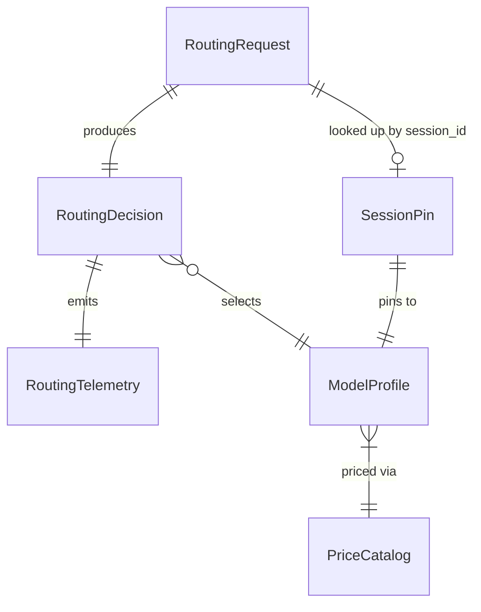
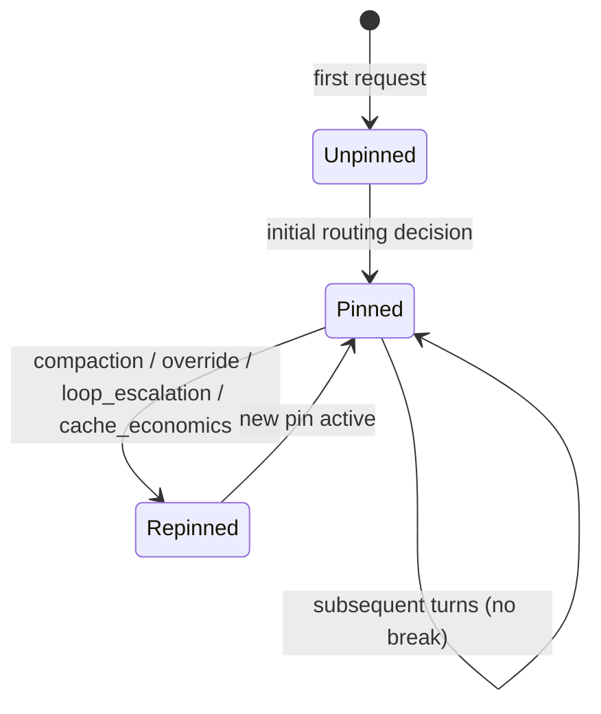

# Data Model: Auto-Model Router MVP

**Feature**: 001-build-smart-router | **Date**: 2026-07-02

## Entity Relationship Overview

## RoutingRequest

Intercepted agent request entering the pipeline.

| Field | Type | Required | Validation |
|-------|------|----------|------------|
| `request_id` | string (UUID) | yes | Unique per request |
| `session_id` | string | yes | Stable across multi-turn session |
| `prompt_text` | string | yes | Sanitized before scoring; max length configurable |
| `messages` | Message[] | no | pi envelope; role + content + tool blocks |
| `turn_type` | enum | no | Derived if absent: `planning`, `tool_result`, `subagent`, `main_loop`, `unknown` |
| `compaction_flag` | boolean | no | true triggers pin break |
| `force_model_id` | string | no | Operator override; sets pin_reason `user_forced` |
| `estimated_input_tokens` | number | no | Used for cache-warmup economics |

## SessionPin

Persisted session routing state (SQLite; in-memory for unit tests).

| Field | Type | Required | Notes |
|-------|------|----------|-------|
| `session_id` | string | yes | Primary key |
| `pinned_model_id` | string | yes | References ModelProfile.id |
| `pin_reason` | enum | yes | `initial`, `user_forced`, `loop_escalation`, `compaction`, `cache_economics` |
| `has_ever_switched` | boolean | yes | Default false |
| `consecutive_upstream_errors` | number | yes | Default 0; reset on success |
| `consecutive_tool_failures` | number | yes | For loop escalation; bounded window |
| `last_tool_failure_signature` | string | null | Hash of tool+error for identical detection |
| `created_at` | ISO8601 | yes | |
| `updated_at` | ISO8601 | yes | |

### State Transitions

**Pin break events**: compaction_flag, force_model_id, loop_escalation threshold, cache_warmup economics approval.

## ModelProfile

One entry in fleet catalog (`models.yaml`).

| Field | Type | Required | Validation |
|-------|------|----------|------------|
| `id` | string | yes | Unique |
| `tier` | enum | yes | `zero-tier`, `economical-cloud`, `frontier-cloud` |
| `provider` | string | yes | e.g. `anthropic`, `lmstudio`, `ollama` |
| `endpoint` | string | no | Override base URL |
| `capabilities.reasoning` | number 0–1 | yes | |
| `capabilities.code_gen` | number 0–1 | yes | |
| `capabilities.tool_use` | number 0–1 | yes | |
| `performance.latency_p50_ms` | number | no | For multi-objective score |
| `performance.verbosity_factor` | number | no | Relative to fleet median |
| `performance.cache_friendly` | boolean | no | Default true |
| `pricing.registry_key` | string | no | LiteLLM lookup key |
| `pricing.fallback_cost_per_1m` | number | yes | USD per 1M tokens baseline |
| `healthy` | boolean | no | Runtime; circuit breaker sets false |

## RoutingDecision

Output of pipeline (live or explain path).

| Field | Type | Required | Notes |
|-------|------|----------|-------|
| `request_id` | string | yes | |
| `selected_model_id` | string | yes | |
| `tier` | enum | yes | |
| `stage` | enum | yes | `triage`, `turn_envelope`, `session_pin`, `local_zero`, `hydra_match`, `fallback` |
| `reason_code` | string | yes | Machine-readable, e.g. `keyword_frontier`, `cyclomatic_high`, `pin_hit` |
| `candidates` | CandidateScore[] | no | Alternatives considered |
| `estimated_cost_usd` | number | no | Based on PriceCatalog |
| `routing_latency_ms` | number | yes | |
| `pin_reason` | string | null | If session pin applied |

### CandidateScore

| Field | Type |
|-------|------|
| `model_id` | string |
| `score` | number |
| `shortfall` | number |
| `rejected_reason` | string | null |

## PriceCatalog

Runtime pricing state (SQLite state store).

| Field | Type | Notes |
|-------|------|-------|
| `registry_snapshot` | Record<string, number> | LiteLLM rates |
| `user_overrides` | Record<string, number> | Operator CLI |
| `last_updated` | ISO8601 | Staleness check |
| `source` | enum | `override`, `registry`, `yaml_fallback` |

## RoutingTelemetry

Audit record (append-only log or OTLP span).

| Field | Type |
|-------|------|
| `timestamp` | ISO8601 |
| `session_id` | string |
| `request_id` | string |
| `turn_type` | string |
| `stage` | string |
| `reason_code` | string |
| `selected_model_id` | string |
| `estimated_cost_usd` | number |
| `routing_latency_ms` | number |
| `pin_reason` | string | null |

## Configuration (Operator)

| Key | Type | Default | Maps to |
|-----|------|---------|---------|
| `frugality.lambda_cost` | number 0–1 | 0.5 | λ_cost |
| `frugality.lambda_latency` | number | 0.1 | λ_latency |
| `frugality.lambda_verbosity` | number | 0.15 | λ_verbosity |
| `loop_escalation.threshold` | number | 3 | Identical tool failures |
| `pricing.staleness_days` | number | 14 | Reminder threshold |
| `local.min_memory_gb_full` | number | 16 | Full local execution (`zero-tier` dispatch) |
| `local.min_memory_gb_classification` | number | 8 | Classification-only local; no full local dispatch |
| `local.battery_threshold_pct` | number | 20 | Disable on battery |
| `hydra.artifact_cache_path` | string | `.pi-smart-router/models/` | ONNX cache; not committed to git |

## Validation Rules Summary

- Shortfall gate: candidate excluded if any capability dimension shortfall > 0 (quality parity).
- Loop escalation: fire once per session when `consecutive_tool_failures >= threshold` with identical signature.
- Local tier: hardware probe returns `full_local`, `classification_only`, or `disabled`. Full local dispatch requires `full_local` AND model actively loaded (ping response). Classification-only mode may run triage locally but MUST NOT dispatch full inference to local tier.
- Rate limit: reject with HTTP **429** when token bucket empty (proxy path). Response MUST include `Retry-After` header (seconds until refill) and body `{ "error": "rate_limit_exceeded", "retry_after_seconds": N }`.
