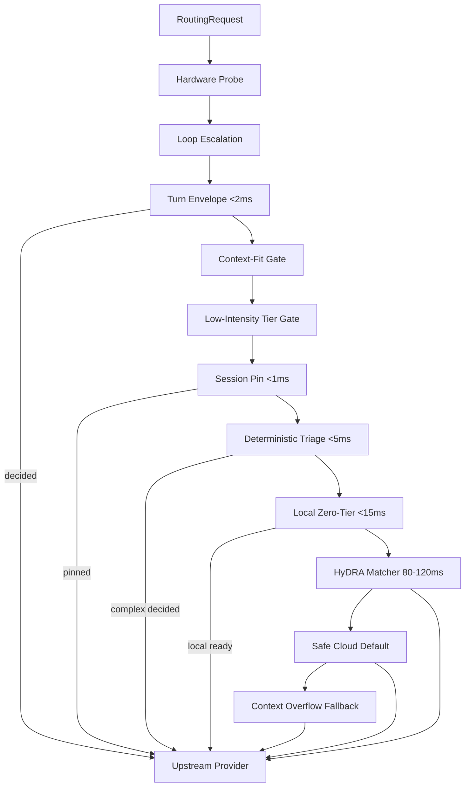

# Implementation Plan: Auto-Model Router MVP

**Branch**: `001-build-smart-router` | **Date**: 2026-07-02 | **Spec**: [spec.md](./spec.md)  
**Input**: Feature specification from `/specs/001-build-smart-router/spec.md`

## Summary

Build pi-smart-router as a TypeScript Node.js middleware package for the pi.dev coding agent. The router intercepts each LLM request and runs a synchronous multi-stage pipeline: hardware probe → deterministic triage → turn envelope analysis → session pinning → local zero-tier gate → HyDRA embedding matcher → resilient gateway dispatch. Decisions are observable via explain endpoint and per-request telemetry. MVP targets macOS Apple Silicon with LM Studio and Ollama as optional local HTTP backends.

Technical approach derives from [docs/PRD.md](../../docs/PRD.md) §3–6 and [research.md](./research.md). User-facing requirements remain in [spec.md](./spec.md); this plan is the implementation source of truth.

## Technical Context

**Language/Version**: TypeScript 5.x strict mode, Node.js 20 LTS (ES modules)  
**Primary Dependencies**: `aho-corasick-node`, `@typescript-eslint/parser`, `@huggingface/transformers` (ONNX/WASM), `better-sqlite3`, `yaml`, `zod` (config validation)  
**Storage**: SQLite via `better-sqlite3` at default path `.pi-smart-router/state.db` (session pins, rate limits, price cache, telemetry retention); WAL mode for single-host multi-process (spine workers); in-memory store for unit tests only; Redis optional post-MVP adapter for distributed multi-host  
**Testing**: Vitest (unit/integration), contract tests against [contracts/](./contracts/)  
**Target Platform**: macOS Apple Silicon (Darwin); pi.dev agent middleware hook  
**Project Type**: npm library + optional local HTTP proxy CLI  
**Performance Goals**: Step 2 triage <5ms; Step 2b turn envelope <2ms; Step 3 pin lookup <1ms; Step 4 local pings <15ms combined; Step 5 embedding 80–120ms median; SC-005 ambiguous path <200ms total routing overhead  
**Constraints**: Zero host-agent crashes; ban `any` on routing paths; no I/O in loops; bounded retry/escalation windows; open-source license  
**Scale/Scope**: Single-host multi-process (pi + spine); SQLite shared state across workers; ~15 pipeline modules across 4 implementation lanes (PRD §6)

## Constitution Check

_GATE: Must pass before Phase 0 research. Re-check after Phase 1 design._

| Principle | Plan Compliance |
|-----------|-----------------|
| I. Predictive pre-generation routing | Pipeline decides before upstream dispatch; loop escalation is telemetry-only |
| II. Input integrity | Confounder sanitization in triage-engine; zod validation on config/envelope |
| III. Cache-aware session pinning | session-pinner with exhaustive break rules |
| IV. Configuration-decoupled matching | models.yaml fleet catalog; HyDRA shortfall without retraining |
| V. Multi-objective agentic routing | Extended score: cost + latency + verbosity |
| VI. Zero-crash resilience | Every stage wraps failures → safe cloud default |
| VII. Latency-budget discipline | Stage budgets documented; early exit on decision |
| VIII. Honest verification | Vitest + spine gates (`npm run typecheck && npm test`) |
| IX–XII. Engineering | Domain pipeline modules; strict TS; fail loud |
| ML inference path | Shape validation; no weights in git; eval mode only |
| Quality & security | Env-based secrets; error-path tests; cache marker preservation |

**Post-design re-check**: PASS — data model separates domain state from SQLite persistence; contracts define explain vs dispatch paths; no unjustified complexity.

## Project Structure

### Documentation (this feature)

```text
specs/001-build-smart-router/
├── plan.md              # This file
├── research.md          # Phase 0 decisions
├── data-model.md        # Phase 1 entities
├── quickstart.md        # Phase 1 dev guide
├── contracts/           # Phase 1 API contracts
│   ├── routing-request.schema.json
│   ├── routing-decision.schema.json
│   ├── explain-endpoint.md
│   └── pi-middleware.md
├── checklists/
│   └── requirements.md
└── tasks.md             # Phase 2 (/spec:tasks output)
```

### Source Code (repository root)

```text
src/
├── domain/
│   ├── types/                 # RoutingRequest, SessionPin, RoutingDecision, etc.
│   ├── pipeline/              # router-pipeline.ts — stage orchestration
│   ├── triage/                # triage-engine.ts, turn-envelope.ts
│   ├── matching/              # hydra-matcher.ts
│   ├── pinning/               # session-pinner.ts, loop-escalation.ts
│   └── scoring/               # multi-objective score, shortfall
├── infrastructure/
│   ├── hardware/              # hardware-probe.ts
│   ├── local/                 # local-zero-tier.ts (LM Studio, Ollama)
│   ├── gateway/               # gateway-dispatch.ts, circuit-breaker.ts
│   ├── pricing/               # price-broker.ts, pricing-monitor.ts
│   ├── persistence/           # sqlite-store.ts, memory-store.ts (tests)
│   └── telemetry/             # routing-telemetry.ts
├── api/
│   ├── explain/               # router-explain.ts
│   └── middleware/            # pi hook integration
├── config/
│   ├── models-loader.ts       # models.yaml parser + zod
│   └── defaults.ts
└── index.ts                   # Public package exports

tests/
├── unit/                      # Per-stage pure logic
├── integration/               # Pipeline end-to-end with mocks
└── contract/                  # Schema validation against contracts/

config/
└── models.yaml.example        # Example fleet catalog

.stet.yaml                     # Lane 4.2 guardrails
package.json
tsconfig.json
vitest.config.ts
```

**Structure Decision**: Single npm package (`src/domain` for business rules, `src/infrastructure` for I/O). Aligns with constitution architecture layers: gateways/repos are transport only; routing rules live in `domain/`.

## Pipeline Design

Synchronous stage order (early exit on decision) — SP-119 integration pass:



Each stage returns `{ decided: boolean, decision?: RoutingDecision, stage: string }`. Failures at any stage → `safeCloudDefault()`: first healthy `economical-cloud` model in models.yaml; if none, first healthy `frontier-cloud` model. Never throw to host agent.

## Implementation Lanes (maps to PRD §6)

### Lane 1: System Introspection & Heuristics

| Task | Module | Spec / FR mapping |
|------|--------|-------------------|
| 1.1 | `hardware-probe.ts` | FR-012; US5 |
| 1.2 | `triage-engine.ts` | FR-003, FR-004; US2 |
| 1.3 | `turn-envelope.ts` | FR-005; US3 |
| 1.4 | `sub-route-policy.ts` | FR-024; US3 |

### Lane 2: State, Cost & Gateway Resilience

| Task | Module | Spec / FR mapping |
|------|--------|-------------------|
| 2.1 | `session-pinner.ts` | FR-006–008, FR-007; US4 |
| 2.2 | `gateway-dispatch.ts` | FR-017, FR-023 |
| 2.2b | `sqlite-store.ts` | FR-025 |
| 2.3 | `circuit-breaker.ts` | FR-018 |
| 2.4 | `price-broker.ts` | FR-019 |
| 2.5 | `pricing-monitor.ts` | FR-020; US7 |
| 2.6 | `routing-telemetry.ts` | FR-016; US6 |

### Lane 3: Routing ML & Local HTTP Backends

| Task | Module | Spec / FR mapping |
|------|--------|-------------------|
| 3.1 | `hydra-matcher.ts` | FR-009–011; US2, US7 |
| 3.1b | `multi-objective.ts` | FR-021; US7 |
| 3.2 | `local-zero-tier.ts` | FR-012–013; US5 |

### Lane 4: Orchestration & Guardrails

| Task | Module | Spec / FR mapping |
|------|--------|-------------------|
| 4.1 | `router-pipeline.ts` | FR-001, FR-022; US1 |
| 4.2 | `.stet.yaml` | FR-022; zero-crash, no `any`, triage bounds |
| 4.3 | `router-explain.ts` | FR-015; US6 |
| 4.4 | `pi-router-install.ts` | Stretch / post-MVP |

## Phase 0 Output

See [research.md](./research.md) — all technical unknowns resolved from PRD and deep-research.

## Phase 1 Output

- [data-model.md](./data-model.md) — entities, validation, state transitions
- [contracts/](./contracts/) — JSON schemas + explain endpoint contract
- [quickstart.md](./quickstart.md) — bootstrap, config, local dev loop

## Agent Context

Updated [.specify/memory/pi-agent.md](../../.specify/memory/pi-agent.md) with active technologies from this plan.

## Complexity Tracking

No constitution violations requiring justification. SQLite + embedding matcher are PRD-mandated; in-memory store for tests only.
